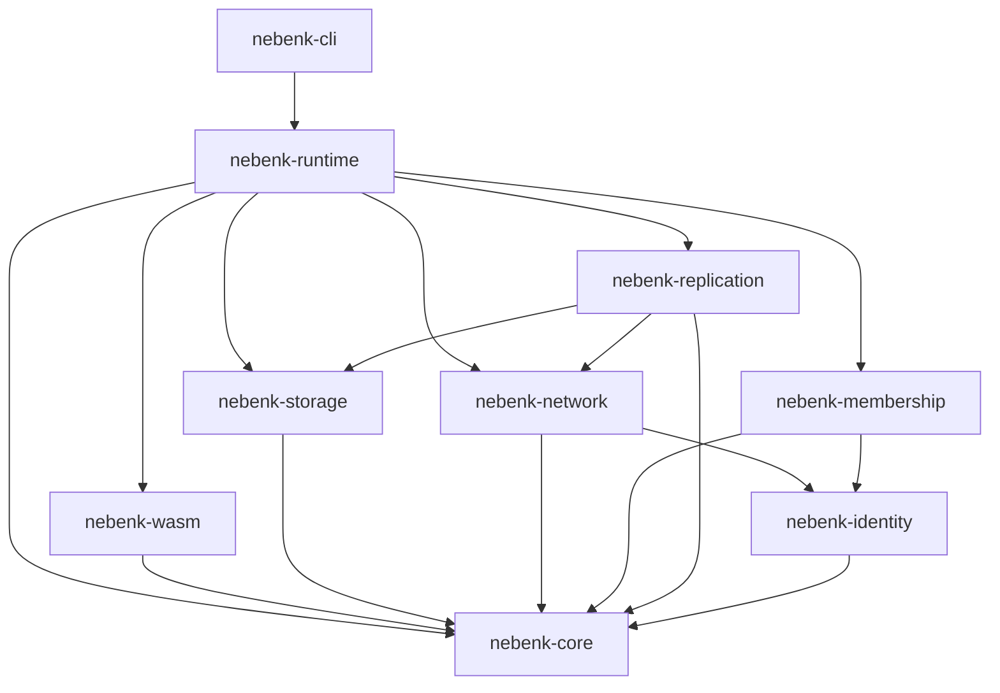
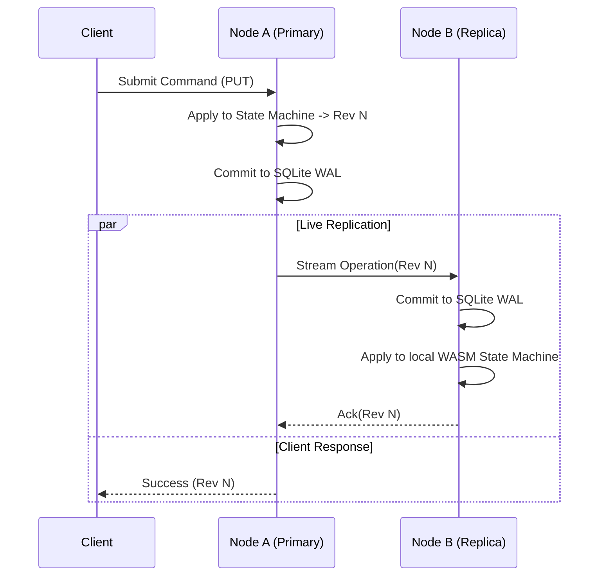

# NEBENK — Technical Design Document

**Status:** Draft / Active  
**Version:** 0.1.0  
**Associated PRD:** [`docs/prd.md`](file:///home/muqtada/Documents/nebenk/docs/prd.md) (v0.4)  
**License:** Apache License 2.0  

---

## 1. Introduction & Objectives

NEBENK is a lightweight, device-agnostic distributed application runtime. It allows stateful applications compiled to WebAssembly (WASM) to run across heterogeneous devices (smartphones, laptops, single-board computers, cloud servers) while maintaining state across individual node disconnections or failures.

This document specifies the technical architecture, protocols, host ABI, storage schemas, and replication semantics for the Phase 0 and Phase 1/MVP implementation.

### 1.1 Key Design Principles
1. **Application ≠ Host Process:** The runtime provides the durable environment; applications are deterministic state machines executed inside sandboxed WebAssembly guests.
2. **Deterministic State Transitions:** State transitions are represented as `Apply(State, Command) -> (NewState, Result)`. Replicas replaying identical operation logs from an identical snapshot reach bit-for-bit identical state.
3. **Layered Decoupling:** Core data structures and state logic (`nebenk-core`) remain agnostic of I/O, storage engines, and network transports.
4. **Pragmatic V1 Semantics:** V1 uses a single-writer primary/replica architecture with explicit durability boundaries, laying the ground for Raft consensus (Phase 6) and CRDTs (Phase 7).

---

## 2. Workspace & Crate Architecture

The repository is structured as a Cargo workspace with strict dependency boundaries:

```
nebenk/
├── Cargo.toml                      # Workspace root manifest
├── docs/
│   ├── prd.md                      # Product requirements
│   └── TECHNICAL_DESIGN.md         # This specification
├── crates/
│   ├── nebenk-core/                # Shared primitives, traits, types, error models
│   ├── nebenk-identity/            # Ed25519 keys, NodeId, invitations, signatures
│   ├── nebenk-storage/             # SQLite state store, WAL, snapshot management
│   ├── nebenk-wasm/                # Wasmtime runtime, host ABI bindings, memory sandboxing
│   ├── nebenk-runtime/             # Node coordinator, state machine manager, local actor
│   ├── nebenk-network/             # libp2p P2P transport (QUIC/TCP), peer discovery
│   ├── nebenk-membership/          # Cluster roster, node heartbeats, failure detectors
│   ├── nebenk-replication/         # V1 primary/replica log streaming, catch-up protocol
│   └── nebenk-cli/                 # Terminal UI & operator commands (`nebenk`)
├── sdk/
│   └── wasm/                       # Guest SDK for authoring NEBENK WASM applications
├── examples/
│   ├── counter/                    # Minimal deterministic counter
│   └── kv/                         # Reference distributed key-value store (MVP)
└── tests/                          # End-to-end multi-node integration test harnesses
```

### 2.1 Crate Responsibilities & Dependency Graph



| Crate | Responsibilities | Key Dependencies |
|---|---|---|
| `nebenk-core` | `NodeId`, `ClusterId`, `Revision`, `Operation`, `Snapshot`, traits (`StateEngine`, `LogStore`, `SnapshotStore`), error types | `serde`, `cbor4ii`, `thiserror` |
| `nebenk-identity` | Ed25519 key generation, storage, signing/verification, cluster invitation tokens | `ed25519-dalek`, `rand`, `subtle` |
| `nebenk-storage` | SQLite implementation of WAL, snapshot repository, local key-value store | `rusqlite`, `tokio-rusqlite`, `tempfile` |
| `nebenk-wasm` | Wasmtime execution engine, guest memory isolation, host function imports/exports | `wasmtime`, `wasmtime-wasi` |
| `nebenk-network` | libp2p Swarm, QUIC/TCP transports, Noise encryption, Yamux multiplexing, mDNS discovery | `libp2p`, `tokio` |
| `nebenk-membership`| Cluster membership list, heartbeat monitoring, Phi accrual failure detector | `nebenk-core`, `nebenk-identity` |
| `nebenk-replication`| Primary log dispatch, replica stream ingestion, catch-up negotiation | `nebenk-core`, `nebenk-storage`, `nebenk-network` |
| `nebenk-runtime` | Top-level node lifecycle coordinator, combining storage, network, wasm, and consensus | `tokio`, `tracing` |
| `nebenk-cli` | CLI binary (`nebenk init`, `run`, `join`, `status`, `apply`) | `clap`, `tokio`, `tracing-subscriber` |

---

## 3. Application Model & WASM Host ABI

NEBENK applications are compiled to `wasm32-wasip1` (or bare `wasm32-unknown-unknown`).

### 3.1 Determinism Constraints
Guests must be completely deterministic:
1. **No direct host clock access:** Calls to system time are intercepted. Time is supplied deterministically via the `OperationEnvelope.timestamp`.
2. **No arbitrary host randomness:** Any random numbers required for transitions must be generated from a deterministic seed in the `OperationEnvelope`.
3. **No direct I/O or network access:** The guest cannot open raw sockets or write to arbitrary host files. All persistence happens through state updates returned to the host.
4. **Deterministic float behavior:** Applications must conform to IEEE 754 with canonical NaN handling or avoid non-deterministic floating-point operations.

### 3.2 Host ABI Specification

Guest modules export the following C-ABI functions:

```c
// Allocate a buffer in guest memory of specified size. Returns offset in WASM linear memory.
int32_t nebenk_alloc(int32_t size);

// Free a previously allocated buffer.
void nebenk_free(int32_t ptr, int32_t size);

// Initialize application state. Returns 0 on success, negative error code on failure.
int32_t nebenk_init(int32_t config_ptr, int32_t config_len);

// Apply a state-changing operation to the current state.
// Output format written to guest memory: [out_result_ptr, out_result_len, out_state_delta_ptr, out_state_delta_len]
int32_t nebenk_apply(
    int32_t op_ptr,
    int32_t op_len,
    int64_t revision,
    int64_t timestamp_ms
);

// Capture a complete snapshot of current state.
// Output: offset and length of serialized state buffer.
int32_t nebenk_snapshot(int32_t out_ptr_buf);

// Restore application state from a serialized snapshot.
int32_t nebenk_restore(int32_t snapshot_ptr, int32_t snapshot_len);

// Execute a read-only query against current state.
int32_t nebenk_query(int32_t query_ptr, int32_t query_len);
```

### 3.3 Application Manifest (`manifest.json`)

Each application package contains a `manifest.json`:

```json
{
  "name": "nebenk-kv",
  "version": "0.1.0",
  "entrypoint": "app.wasm",
  "state_model": "deterministic_wal",
  "memory": {
    "initial_pages": 16,
    "max_pages": 256
  },
  "capabilities": [
    "state_storage"
  ]
}
```

---

## 4. State Representation, Log & Snapshots

### 4.1 Revisions and Sequences
* **`Revision` (`u64`):** Strictly monotonic operation counter starting at `1`. `Revision 0` indicates uninitialized state.
* **`Snapshot`:** A complete serialized representation of application state at revision $R$.
* **`Operation Log`:** An append-only sequence of operations applied strictly after revision $R_{snapshot}$.

### 4.2 CBOR Envelope Formats

All wire messages, WAL records, and snapshots are serialized using CBOR (`RFC 8949`).

#### Operation Envelope (`OperationEnvelope`)
```rust
pub struct OperationEnvelope {
    pub revision: u64,
    pub cluster_id: ClusterId,
    pub author_node: NodeId,
    pub timestamp_ms: u64,
    pub payload: Vec<u8>,
    pub signature: Vec<u8>, // Signed by author or primary
}
```

#### Snapshot Envelope (`SnapshotHeader`)
```rust
pub struct SnapshotHeader {
    pub format_version: u32,
    pub cluster_id: ClusterId,
    pub revision: u64,
    pub state_hash: [u8; 32], // BLAKE3 hash of snapshot data
    pub timestamp_ms: u64,
    pub compressed_size: u64,
    pub uncompressed_size: u64,
}
```

---

## 5. Local Storage Schema (SQLite)

Local durability is implemented in `nebenk-storage` using SQLite with WAL mode enabled (`PRAGMA journal_mode=WAL; PRAGMA synchronous=NORMAL;`).

```sql
-- Node and cluster local configuration
CREATE TABLE IF NOT EXISTS metadata (
    key TEXT PRIMARY KEY,
    value BLOB NOT NULL
);

-- Append-only operation log
CREATE TABLE IF NOT EXISTS operation_log (
    revision INTEGER PRIMARY KEY,
    author_node_id BLOB NOT NULL,
    timestamp_ms INTEGER NOT NULL,
    payload BLOB NOT NULL,
    signature BLOB NOT NULL
);

-- Snapshots index
CREATE TABLE IF NOT EXISTS snapshots (
    revision INTEGER PRIMARY KEY,
    timestamp_ms INTEGER NOT NULL,
    state_hash BLOB NOT NULL,
    compressed_data BLOB NOT NULL
);

-- Known cluster members
CREATE TABLE IF NOT EXISTS cluster_members (
    node_id BLOB PRIMARY KEY,
    public_key BLOB NOT NULL,
    role TEXT NOT NULL,          -- 'primary', 'replica', 'observer'
    status TEXT NOT NULL,        -- 'active', 'syncing', 'suspected', 'left'
    last_seen_ms INTEGER NOT NULL,
    last_synced_rev INTEGER NOT NULL DEFAULT 0
);
```

---

## 6. Cryptographic Identity & Security

### 6.1 Node Identity
Each node generates an **Ed25519** keypair upon initial creation (`nebenk init`):
* **Private Key:** Stored locally with restricted permissions (`0600`).
* **Public Key:** 32-byte Ed25519 public key.
* **`NodeId`:** Canonical base58-encoded representation of the 32-byte public key.

### 6.2 Cluster Invitations
Joining a cluster requires an invitation token signed by an active administrator or cluster primary:

```
nebenk-invite://<CLUSTER_ID>/<EXPIRY_EPOCH>/<PEER_ADDR>?sig=<ED25519_SIG>
```

When a joining node connects:
1. It establishes an encrypted Noise channel (`Noise_XX_25519_ChaChaPoly_BLAKE2s`) via libp2p.
2. It presents the invite token and signs a cryptographic challenge proving possession of its private key.
3. The cluster records the new node's public key in `cluster_members`.

---

## 7. P2P Networking & Protocols

NEBENK uses **libp2p** for transport, discovery, and multiplexing.

### 7.1 Protocol Identifiers
* `/nebenk/id/1.0.0`: Mutual identity verification and handshake.
* `/nebenk/heartbeat/1.0.0`: Liveness heartbeats and cluster membership gossip.
* `/nebenk/rep/1.0.0`: Live operation log streaming from primary to replicas.
* `/nebenk/sync/1.0.0`: Catch-up negotiation and chunked snapshot transfer.

### 7.2 Transport Configuration
* **Primary Transport:** QUIC (`libp2p-quic`) with native TLS 1.3 encryption.
* **Fallback Transport:** TCP + Noise + Yamux.
* **Discovery:** Local network mDNS for zero-config device discovery; direct dial for remote IP/ports.

---

## 8. Replication & Failure Recovery (V1)

### 8.1 Primary / Replica State Lifecycle



### 8.2 V1 Durability & Consistency Boundary
* **Local Commit:** An operation is acknowledged to the local caller once committed to the Primary's SQLite WAL.
* **Replica Ack:** Live replication to replicas occurs asynchronously over `/nebenk/rep/1.0.0`.
* **Failure Window:** If the Primary terminates unexpectedly before an operation is transmitted to any replica, that operation is not yet replicated. V1 acknowledges this trade-off explicitly until Raft consensus is introduced in Phase 6.

### 8.3 Node Joining & State Catch-up
When a replica connects or reconnects:
1. Replica sends `SyncRequest { last_known_rev }`.
2. Primary inspects its available range:
   * **Log replay:** If `last_known_rev >= lowest_available_log_rev`, Primary streams missing operations `[last_known_rev + 1 .. latest_rev]`.
   * **Snapshot + Log:** If `last_known_rev < lowest_available_log_rev`, Primary sends `SnapshotHeader` followed by chunked snapshot data (64KB chunks), then streams remaining operations.
3. Replica verifies `BLAKE3` hash of the reconstructed snapshot, restores WASM guest state, applies subsequent operations, and transitions from `SYNCING` to `ACTIVE`.

---

## 9. Failure Detection & Failover

### 9.1 Heartbeats & Suspicion
* Nodes exchange heartbeats every **1,000 ms** over `/nebenk/heartbeat/1.0.0`.
* If no heartbeat or frame is received from a peer within **3,000 ms**, the peer is marked `SUSPECTED`.
* If silence persists beyond **7,000 ms**, the peer is transitioned to `FAILED`.

### 9.2 Failover (V1)
In V1, with an ordered replica list:
1. When Primary fails, the highest-priority reachable replica with the greatest verified `Revision` initiates failover.
2. The replica asserts Primary status and begins accepting writes.
3. If the old Primary returns, it detects the higher revision / newer term, steps down to Replica, and requests sync.

---

## 10. Reference Application: Distributed KV Store (`examples/kv`)

The MVP reference application is a deterministic key-value store compiled to `app.wasm`.

### 10.1 Operations
```rust
pub enum KvOperation {
    Put { key: String, value: Vec<u8> },
    Delete { key: String },
}

pub enum KvQuery {
    Get { key: String },
    ListPrefix { prefix: String },
}
```

### 10.2 State Machine
* **Internal State:** In-memory `BTreeMap<String, Vec<u8>>`.
* **Snapshot:** Deterministic CBOR map encoding of all key-value entries.
* **Deterministic Transition:**
  * `Put`: Insert/update key, return previous value if any.
  * `Delete`: Remove key, return removed value if any.

---

## 11. Verification Plan & Testing Matrix

| Test Level | Scope | Verification Method |
|---|---|---|
| **Unit Tests** | `nebenk-core`, `nebenk-identity`, `nebenk-storage` | In-memory SQLite tests, CBOR roundtrips, key signing/verifying |
| **WASM Sandbox** | `nebenk-wasm` | Compile test WASM module, verify `apply`, memory growth limits, deterministic snapshot/restore |
| **Sync Integration** | `nebenk-replication` | Start Primary, write 100 ops, trigger snapshot, start new Replica, verify exact state convergence |
| **3-Node Demo** | End-to-End | Run 3 separate node instances on loopback interfaces, execute canonical demo (PUT, crash Primary, verify Replica read/write, rejoin) |
